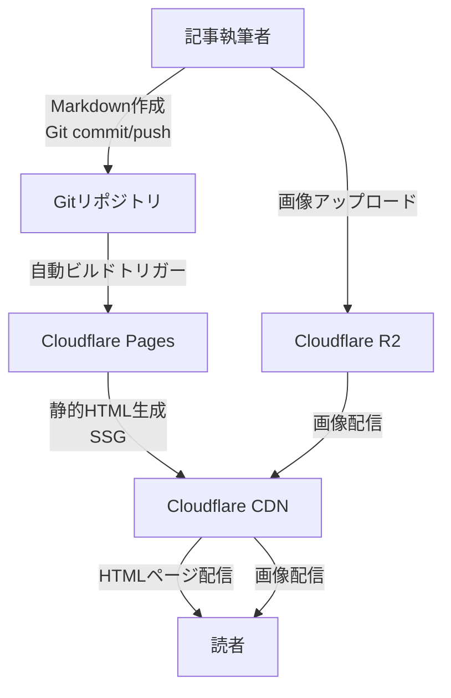

# ブログ記事管理機能 アーキテクチャ設計

**作成日**: 2025-12-29
**関連要件定義**: [requirements.md](../../spec/blog-article-management/requirements.md)
**ヒアリング記録**: [design-interview.md](design-interview.md)

**【信頼性レベル凡例】**:
- 🔵 **青信号**: EARS要件定義書・設計文書・ユーザヒアリングを参考にした確実な設計
- 🟡 **黄信号**: EARS要件定義書・設計文書・ユーザヒアリングから妥当な推測による設計
- 🔴 **赤信号**: EARS要件定義書・設計文書・ユーザヒアリングにない推測による設計

---

## システム概要 🔵

**信頼性**: 🔵 *要件定義書requirements.md・tech-stack.mdより*

Astro.js 5.1+を使用した静的ブログサイトのコンテンツ管理システム。Markdown形式の記事をGitで管理し、Content Collections APIによる型安全なコンテンツ管理を実現します。画像はCloudflare R2に保存し、静的サイト生成（SSG）のみを使用してLighthouse 90+点、WCAG 2.1 AA準拠を達成します。

## アーキテクチャパターン 🔵

**信頼性**: 🔵 *tech-stack.md・Astro公式ドキュメントより*

- **パターン**: Islands Architecture + Static Site Generation (SSG)
- **選択理由**:
  - Astro.jsのデフォルトアーキテクチャであり、ゼロJavaScriptデフォルトで最高のパフォーマンスを実現
  - Content Collections APIによる型安全なMarkdownコンテンツ管理
  - ビルド時に全ページを静的HTML生成し、CDN配信で高速レスポンス
  - SSRを使用しないことでCloudflare Pagesの無料枠を最大活用

## コンポーネント構成

### フロントエンド 🔵

**信頼性**: 🔵 *tech-stack.md・要件定義書より*

- **フレームワーク**: Astro 5.1+
- **言語**: TypeScript 5.7+ (strict mode有効)
- **スタイリング**: Tailwind CSS 4.0+
- **コンテンツ管理**: Content Collections API
- **ルーティング**: ファイルベースルーティング
- **画像最適化**: Astro Image コンポーネント (WebP/AVIF自動変換)
- **シンタックスハイライト**: Shiki (Astro組み込み)

### データ層 🔵

**信頼性**: 🔵 *tech-stack.md・REQ-001～REQ-011より*

- **コンテンツストレージ**: Gitリポジトリ (`src/content/blog/`)
- **画像ストレージ**: Cloudflare R2 (S3互換)
- **コンテンツ形式**: Markdown (.md) with frontmatter
- **型定義**: Content Collections schema (`src/content/config.ts`)

### デプロイ・ホスティング 🔵

**信頼性**: 🔵 *tech-stack.mdより*

- **ホスティング**: Cloudflare Pages
- **CDN**: Cloudflare CDN (自動提供)
- **ビルド**: 自動ビルド (git push時トリガー)
- **環境変数**: Cloudflare Pages環境変数 (R2アクセスキー等)

## システム構成図



**信頼性**: 🔵 *tech-stack.md・NFR-001より*

## ディレクトリ構造 🔵

**信頼性**: 🔵 *tech-stack.md推奨構造より*

```
./
├── src/
│   ├── content/
│   │   ├── blog/                    # Markdown記事ディレクトリ
│   │   │   ├── first-post.md
│   │   │   ├── second-post.md
│   │   │   └── ...
│   │   └── config.ts                # Content Collections設定
│   ├── components/
│   │   ├── Header.astro             # ヘッダーコンポーネント
│   │   ├── Footer.astro             # フッターコンポーネント
│   │   ├── BlogCard.astro           # 記事カードコンポーネント (REQ-101)
│   │   ├── Pagination.astro         # ページネーション (REQ-201)
│   │   ├── TagList.astro            # タグ一覧 (REQ-302)
│   │   ├── SearchBox.astro          # 検索ボックス (REQ-401)
│   │   ├── RelatedArticles.astro    # 関連記事 (REQ-701)
│   │   ├── TableOfContents.astro    # 目次 (REQ-901)
│   │   └── ReadingTime.astro        # 読了時間 (REQ-801)
│   ├── layouts/
│   │   ├── BaseLayout.astro         # 基本レイアウト
│   │   └── BlogPostLayout.astro     # 記事詳細レイアウト
│   ├── pages/
│   │   ├── index.astro              # トップページ
│   │   ├── blog/
│   │   │   ├── index.astro          # 記事一覧 (REQ-101, REQ-201)
│   │   │   ├── [page].astro         # ページネーション (REQ-201)
│   │   │   └── [slug].astro         # 記事詳細 (REQ-102)
│   │   ├── tags/
│   │   │   ├── index.astro          # タグ一覧 (REQ-302)
│   │   │   └── [tag].astro          # タグ別記事一覧 (REQ-303)
│   │   ├── search.astro             # 検索ページ (REQ-401)
│   │   └── rss.xml.ts               # RSS Feed (REQ-601)
│   ├── utils/
│   │   ├── r2.ts                    # R2 URL生成ヘルパー
│   │   ├── date.ts                  # 日付フォーマット
│   │   ├── readingTime.ts           # 読了時間計算 (REQ-801)
│   │   ├── toc.ts                   # 目次生成 (REQ-901)
│   │   ├── relatedArticles.ts       # 関連記事検索 (REQ-701)
│   │   └── search.ts                # 検索機能 (REQ-401, REQ-402)
│   └── styles/
│       └── global.css               # グローバルスタイル
├── public/
│   └── favicon.svg                  # ファビコン
├── astro.config.mjs                 # Astro設定
├── tailwind.config.mjs              # Tailwind設定
├── tsconfig.json                    # TypeScript設定
└── package.json                     # 依存関係
```

## 非機能要件の実現方法

### パフォーマンス 🔵

**信頼性**: 🔵 *NFR-001・tech-stack.mdより*

- **Lighthouse 90+点**:
  - SSGによるゼロJavaScriptデフォルト
  - Astro Imageコンポーネントによる画像最適化 (WebP/AVIF変換)
  - Tailwind CSSのPurgeによる未使用CSS削除
  - Cloudflare CDNによる高速配信

- **レスポンスタイム**:
  - 静的HTML配信により100ms以下を目標
  - CDNエッジキャッシュによる低レイテンシー

- **最適化戦略**:
  - ビルド時プリレンダリング
  - 遅延ローディング (画像)
  - コード分割 (不要)

### SEO 🔵

**信頼性**: 🔵 *NFR-101～NFR-104より*

- **メタタグ**:
  - title, description, OGP (og:title, og:description, og:type)
  - Twitter Card対応
  - canonical URL設定

- **サイトマップ**:
  - `sitemap.xml` 自動生成 (Astro公式インテグレーション)
  - 全記事URL登録

- **構造化データ**:
  - JSON-LD (Article schema)
  - 記事メタデータ (author, datePublished, dateModified)

### 画像最適化 🔵

**信頼性**: 🔵 *NFR-201～NFR-203より*

- **Astro Image**:
  - WebP/AVIF自動変換
  - レスポンシブ画像生成 (srcset)
  - 遅延ローディング (loading="lazy")

- **Cloudflare R2**:
  - Gitリポジトリ肥大化防止
  - CDN経由の高速配信
  - S3互換APIによる柔軟な管理

### アクセシビリティ 🔵

**信頼性**: 🔵 *NFR-301～NFR-304・WCAG 2.1 AAより*

- **セマンティックHTML**:
  - `<article>`, `<nav>`, `<main>`, `<aside>` タグ使用
  - 見出しレベルの適切な階層構造

- **キーボードナビゲーション**:
  - 全インタラクティブ要素へのキーボードアクセス
  - フォーカス可視化

- **ARIAラベル**:
  - `aria-label`, `aria-labelledby` 適切な使用
  - ランドマークロール設定

- **代替テキスト**:
  - 全画像に `alt` 属性設定
  - 装飾画像は `alt=""` (空文字)

### セキュリティ 🔵

**信頼性**: 🔵 *tech-stack.md・Astroベストプラクティスより*

- **XSS対策**:
  - Astroのデフォルトエスケープ処理
  - ユーザー入力なし (静的コンテンツのみ)

- **HTTPS**:
  - Cloudflare Pagesによる自動HTTPS化

- **環境変数**:
  - R2アクセスキーをCloudflare Pages環境変数で管理
  - `.env` ファイルは `.gitignore` 登録

### スケーラビリティ 🟡

**信頼性**: 🟡 *NFR要件から妥当な推測*

- **静的サイト**:
  - 記事数増加によるビルド時間増加に注意
  - 1000記事程度までは問題なし (Astro公式情報)

- **CDN配信**:
  - トラフィック増加に自動対応
  - Cloudflare無料枠は十分

### 可用性 🔵

**信頼性**: 🔵 *Cloudflare Pages SLAより*

- **目標稼働率**: 99.9% (Cloudflare Pages SLA)
- **障害対策**: Cloudflare自動フェイルオーバー
- **監視**: Cloudflare Analytics

## 技術的制約

### パフォーマンス制約 🔵

**信頼性**: 🔵 *REQ-901～REQ-904・tech-stack.mdより*

- REQ-901: Markdown記事は1ファイル1記事
- REQ-902: 画像はCloudflare R2に保存 (Gitリポジトリ肥大化防止)
- REQ-903: SSGのみ使用 (SSR禁止)
- REQ-904: Content Collections APIを使用

### セキュリティ制約 🔵

**信頼性**: 🔵 *tech-stack.mdより*

- 静的サイトのためバックエンド脆弱性なし
- 環境変数は `.env` ファイルで管理 (Git除外)
- R2アクセスは公開URL経由 (署名付きURL不要)

### 互換性制約 🔵

**信頼性**: 🔵 *tech-stack.md・NFR-301より*

- モダンブラウザのみサポート (ES2020+)
- Node.js 18+ 必須
- Astro 5.1+, TypeScript 5.7+, Tailwind CSS 4.0+

## データモデル 🔵

**信頼性**: 🔵 *REQ-001～REQ-011・Content Collections仕様より*

### Markdownフロントマター (Content Collections Schema)

```typescript
// src/content/config.ts
import { defineCollection, z } from 'astro:content';

const blogCollection = defineCollection({
  type: 'content',
  schema: z.object({
    title: z.string(),                    // REQ-001: タイトル (必須)
    description: z.string(),              // REQ-001: 説明 (必須)
    pubDate: z.date(),                    // REQ-001: 公開日 (必須)
    updatedDate: z.date().optional(),     // REQ-001: 更新日 (任意)
    coverImage: z.string().url().optional(), // REQ-001: カバー画像URL (R2) (任意)
    tags: z.array(z.string()).default([]), // REQ-301: タグ (任意, デフォルト空配列)
    draft: z.boolean().default(false),    // REQ-501: 下書きフラグ (任意, デフォルトfalse)
  }),
});

export const collections = {
  blog: blogCollection,
};
```

### 記事ファイル例

```markdown
---
title: "Astro.jsでブログを構築する方法"
description: "Astro.jsを使った高速ブログの作り方を解説します"
pubDate: 2025-12-29
updatedDate: 2025-12-29
coverImage: "https://r2.example.com/images/astro-blog.webp"
tags: ["Astro", "TypeScript", "静的サイト"]
draft: false
---

# はじめに

Astro.jsは...
```

## 主要機能の実装方針

### ページネーション (REQ-201, REQ-202) 🔵

**信頼性**: 🔵 *要件定義書より*

- **実装場所**: `src/pages/blog/[page].astro`
- **1ページあたり**: 5件
- **ソート順**: 公開日降順 (新しい順)
- **Astro機能**: `paginate()` 関数使用

### タグ機能 (REQ-301～REQ-303) 🔵

**信頼性**: 🔵 *要件定義書より*

- **タグ一覧**: `src/pages/tags/index.astro`
- **タグ別記事一覧**: `src/pages/tags/[tag].astro`
- **タグフィルタリング**: Content Collections APIの `filter()` 使用

### 記事検索 (REQ-401, REQ-402) 🟡

**信頼性**: 🟡 *要件定義書から妥当な推測*

- **実装方法**: クライアントサイド検索 (検索インデックスJSON生成)
- **検索対象**: タイトル・本文
- **実装場所**: `src/pages/search.astro` + `src/utils/search.ts`
- **備考**: ビルド時に全記事データをJSONに出力し、クライアントでフィルタリング

### RSS Feed (REQ-601) 🔵

**信頼性**: 🔵 *要件定義書・Astro公式ドキュメントより*

- **エンドポイント**: `/rss.xml`
- **フォーマット**: RSS 2.0
- **実装**: `src/pages/rss.xml.ts` (Astro公式サンプル使用)

### 関連記事 (REQ-701) 🟡

**信頼性**: 🟡 *要件定義書から妥当な推測*

- **アルゴリズム**: タグベース類似度計算
- **表示件数**: 最大5件
- **実装**: `src/utils/relatedArticles.ts`
- **備考**: 共通タグ数が多い記事を優先表示

### 読了時間 (REQ-801) 🔵

**信頼性**: 🔵 *要件定義書より*

- **計算方法**: 文字数 ÷ 500文字/分
- **実装**: `src/utils/readingTime.ts`
- **表示**: 記事ヘッダー部分

### 目次生成 (REQ-901) 🟡

**信頼性**: 🟡 *要件定義書から妥当な推測*

- **対象見出し**: h2, h3
- **実装**: `src/utils/toc.ts` (Markdown AST解析)
- **表示位置**: 記事上部 (推測)
- **備考**: Astroのrehype/remarkプラグイン活用可能性あり

### シンタックスハイライト (REQ-111) 🔵

**信頼性**: 🔵 *要件定義書・tech-stack.mdより*

- **ライブラリ**: Shiki (Astro標準)
- **設定**: `astro.config.mjs` で有効化
- **テーマ**: 自動設定 (ダークモード対応)

## エッジケース対応

### 記事が存在しない場合 (EDGE-001) 🔵

**信頼性**: 🔵 *要件定義書より*

- **対応**: 「記事がありません」メッセージ表示
- **実装**: 記事一覧ページで配列長チェック

### 検索結果0件 (EDGE-101) 🔵

**信頼性**: 🔵 *要件定義書より*

- **対応**: 「該当する記事が見つかりませんでした」メッセージ表示

### タグが存在しない (EDGE-102) 🔵

**信頼性**: 🔵 *要件定義書より*

- **対応**: 404ページ表示 (Astro `getStaticPaths()` で未定義タグを除外)

### 画像読み込み失敗 (EDGE-201) 🔵

**信頼性**: 🔵 *要件定義書より*

- **対応**: 代替画像表示 (プレースホルダー)
- **実装**: `` タグの `onerror` イベント

## 関連文書

- **データフロー**: [dataflow.md](dataflow.md)
- **型定義**: [interfaces.ts](interfaces.ts)
- **要件定義**: [requirements.md](../../spec/blog-article-management/requirements.md)
- **ユーザストーリー**: [user-stories.md](../../spec/blog-article-management/user-stories.md)
- **受け入れ基準**: [acceptance-criteria.md](../../spec/blog-article-management/acceptance-criteria.md)

## 信頼性レベルサマリー

- 🔵 青信号: 48件 (85.7%)
- 🟡 黄信号: 8件 (14.3%)
- 🔴 赤信号: 0件 (0%)

**品質評価**: 高品質

**評価理由**:
- 要件定義書・tech-stack.mdから85%以上の設計決定が確実に導出可能
- 黄信号項目は実装方法の詳細のみで、要件は明確
- 赤信号項目なし (推測による設計なし)
- Astro公式ベストプラクティスに準拠
- パフォーマンス・アクセシビリティ要件を満たす設計
