# ブログ記事管理機能 データフロー図

**作成日**: 2025-12-29
**関連アーキテクチャ**: [architecture.md](architecture.md)
**関連要件定義**: [requirements.md](../../spec/blog-article-management/requirements.md)

**【信頼性レベル凡例】**:
- 🔵 **青信号**: EARS要件定義書・設計文書・ユーザヒアリングを参考にした確実なフロー
- 🟡 **黄信号**: EARS要件定義書・設計文書・ユーザヒアリングから妥当な推測によるフロー
- 🔴 **赤信号**: EARS要件定義書・設計文書・ユーザヒアリングにない推測によるフロー

---

## システム全体のデータフロー 🔵

**信頼性**: 🔵 *tech-stack.md・Astroビルドプロセスより*

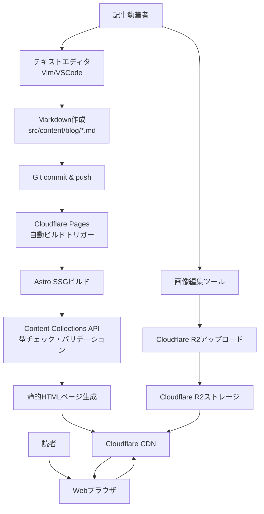

## 主要機能のデータフロー

### 機能1: 記事一覧表示 (REQ-101, REQ-201) 🔵

**信頼性**: 🔵 *ユーザーストーリー1.2・受け入れ基準TC-101より*

**関連要件**: REQ-101, REQ-201, REQ-202

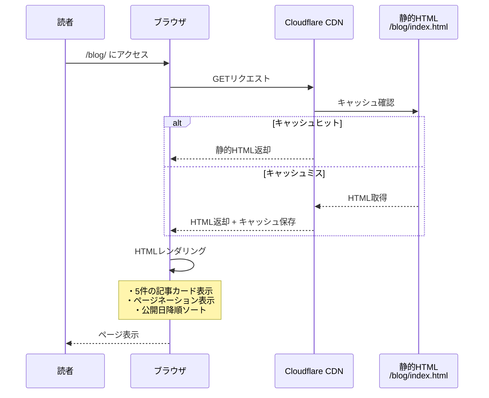

**詳細ステップ**:
1. 読者が `/blog/` または `/blog/2/` にアクセス
2. Cloudflare CDNが静的HTMLを返却 (エッジキャッシュ)
3. ブラウザがHTMLをレンダリング
4. 5件の記事カード (タイトル、説明、公開日、タグ、カバー画像) 表示
5. ページネーションリンク表示 (前へ/次へ)

**ビルド時の処理** (Astro SSG):
```typescript
// src/pages/blog/[page].astro
export async function getStaticPaths({ paginate }) {
  const allPosts = await getCollection('blog', ({ data }) => {
    return data.draft !== true; // REQ-502: 下書きを除外
  });

  // REQ-202: 公開日降順ソート
  const sortedPosts = allPosts.sort((a, b) =>
    b.data.pubDate.valueOf() - a.data.pubDate.valueOf()
  );

  // REQ-201: 5件/ページでページネーション
  return paginate(sortedPosts, { pageSize: 5 });
}
```

### 機能2: 記事詳細表示 (REQ-102) 🔵

**信頼性**: 🔵 *ユーザーストーリー1.1・受け入れ基準TC-102より*

**関連要件**: REQ-102, REQ-103, REQ-104, REQ-701, REQ-801, REQ-901

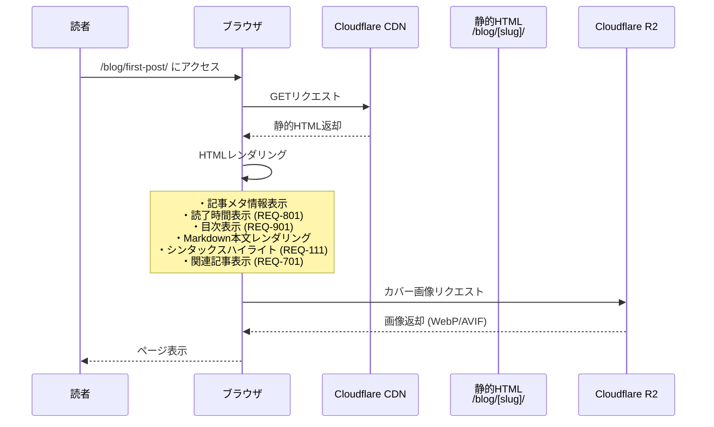

**詳細ステップ**:
1. 読者が `/blog/[slug]/` にアクセス
2. Cloudflare CDNが静的HTMLを返却
3. ブラウザがHTMLをレンダリング:
   - タイトル、説明、公開日、更新日表示 (REQ-103)
   - 読了時間表示: 文字数 ÷ 500文字/分 (REQ-801)
   - 目次表示: h2, h3見出しから自動生成 (REQ-901)
   - Markdown本文: シンタックスハイライト適用 (REQ-111)
   - タグリスト表示 (REQ-104)
   - 関連記事5件表示: タグベース類似度計算 (REQ-701)
4. R2から画像を遅延ローディング (REQ-105)

**ビルド時の処理** (Astro SSG):
```typescript
// src/pages/blog/[slug].astro
export async function getStaticPaths() {
  const allPosts = await getCollection('blog', ({ data }) => {
    return data.draft !== true; // REQ-502: 下書きを除外
  });

  return allPosts.map(post => ({
    params: { slug: post.slug },
    props: { post },
  }));
}

const { post } = Astro.props;
const { Content, headings } = await post.render(); // Markdown→HTML変換

// REQ-801: 読了時間計算
const readingTime = calculateReadingTime(post.body);

// REQ-901: 目次生成 (headingsから)
const toc = generateTOC(headings);

// REQ-701: 関連記事検索
const relatedPosts = await findRelatedPosts(post, 5);
```

### 機能3: タグ別記事一覧 (REQ-303) 🔵

**信頼性**: 🔵 *ユーザーストーリー2.3・受け入れ基準TC-303より*

**関連要件**: REQ-303

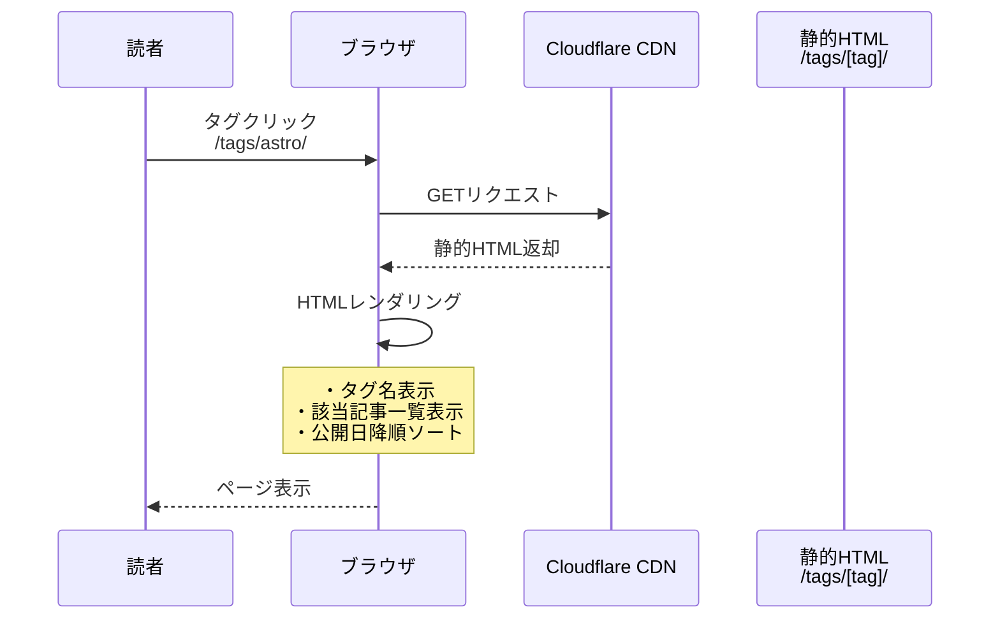

**詳細ステップ**:
1. 読者が記事詳細ページのタグをクリック
2. `/tags/[tag]/` にナビゲート
3. 該当タグを持つ記事一覧を表示
4. 公開日降順でソート

**ビルド時の処理**:
```typescript
// src/pages/tags/[tag].astro
export async function getStaticPaths() {
  const allPosts = await getCollection('blog', ({ data }) => {
    return data.draft !== true;
  });

  // すべてのタグを抽出
  const allTags = [...new Set(allPosts.flatMap(post => post.data.tags))];

  return allTags.map(tag => {
    const filteredPosts = allPosts
      .filter(post => post.data.tags.includes(tag))
      .sort((a, b) => b.data.pubDate.valueOf() - a.data.pubDate.valueOf());

    return {
      params: { tag },
      props: { posts: filteredPosts, tag },
    };
  });
}
```

### 機能4: 記事検索 (REQ-401, REQ-402) 🟡

**信頼性**: 🟡 *要件から妥当な推測 (クライアントサイド検索)*

**関連要件**: REQ-401, REQ-402

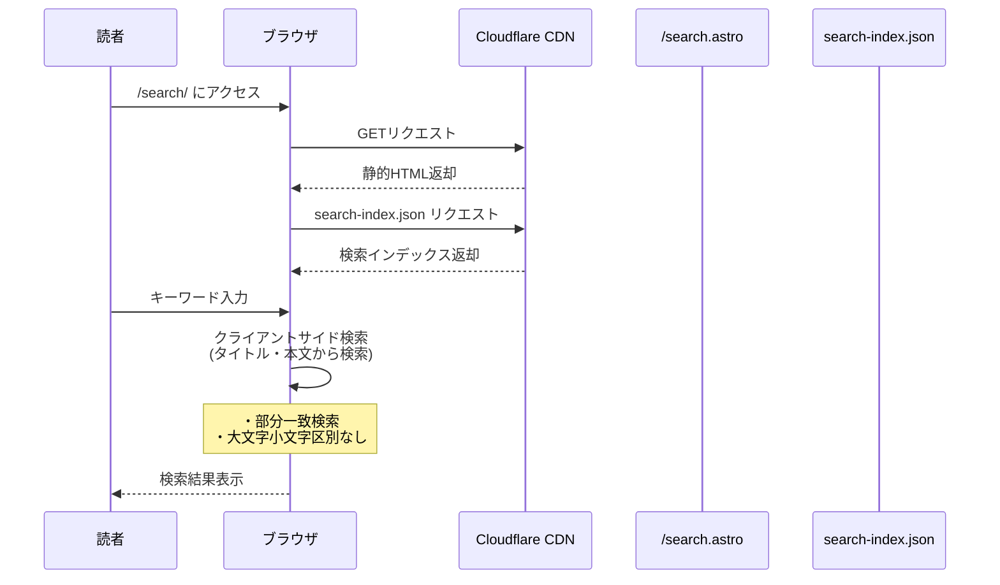

**備考**: ビルド時に全記事データ (タイトル・本文・URL) をJSONに出力し、クライアント側でフィルタリングする方式を推測。パフォーマンス要件 (Lighthouse 90+) を考慮し、記事数が多い場合はビルド時検索インデックス生成も検討可能。

**ビルド時の処理**:
```typescript
// src/pages/search-index.json.ts
export async function GET() {
  const allPosts = await getCollection('blog', ({ data }) => {
    return data.draft !== true;
  });

  const searchIndex = allPosts.map(post => ({
    slug: post.slug,
    title: post.data.title,
    description: post.data.description,
    body: post.body.substring(0, 500), // 最初の500文字のみ
  }));

  return new Response(JSON.stringify(searchIndex));
}
```

### 機能5: RSS Feed生成 (REQ-601) 🔵

**信頼性**: 🔵 *要件定義書・Astro公式ドキュメントより*

**関連要件**: REQ-601

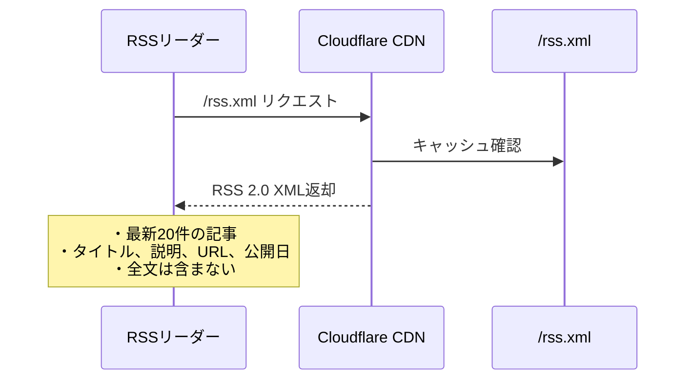

**ビルド時の処理**:
```typescript
// src/pages/rss.xml.ts
import rss from '@astrojs/rss';

export async function GET(context) {
  const allPosts = await getCollection('blog', ({ data }) => {
    return data.draft !== true;
  });

  const sortedPosts = allPosts
    .sort((a, b) => b.data.pubDate.valueOf() - a.data.pubDate.valueOf())
    .slice(0, 20); // 最新20件

  return rss({
    title: 'ブログタイトル',
    description: 'ブログの説明',
    site: context.site,
    items: sortedPosts.map(post => ({
      title: post.data.title,
      description: post.data.description,
      pubDate: post.data.pubDate,
      link: `/blog/${post.slug}/`,
    })),
  });
}
```

### 機能6: 関連記事表示 (REQ-701) 🟡

**信頼性**: 🟡 *要件から妥当な推測 (タグベース類似度)*

**関連要件**: REQ-701

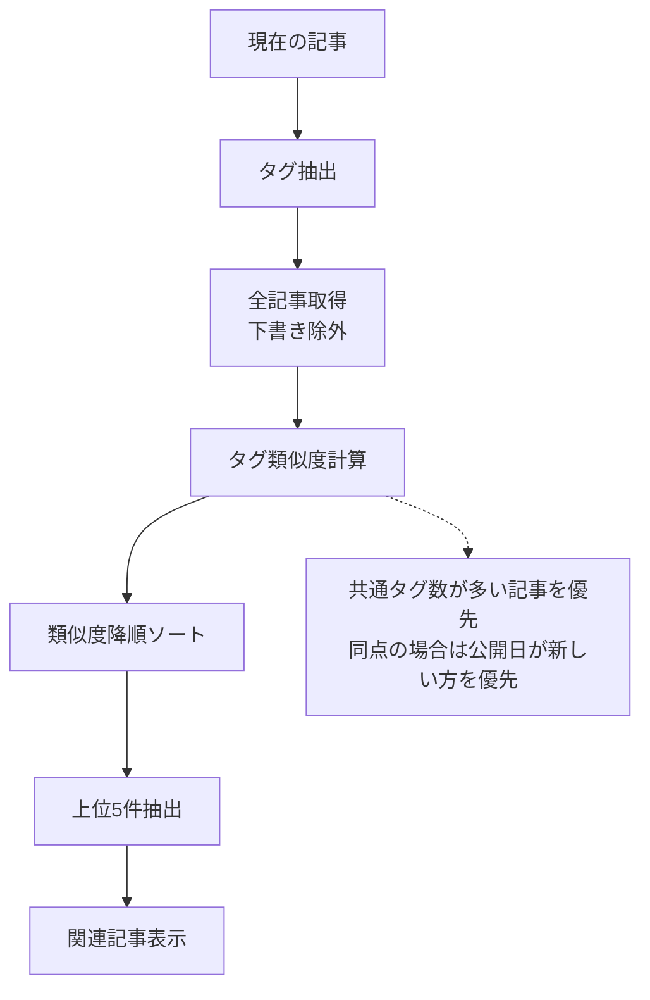

**アルゴリズム詳細**:
```typescript
// src/utils/relatedArticles.ts
export function findRelatedPosts(currentPost, limit = 5) {
  const currentTags = currentPost.data.tags;

  const scored = allPosts
    .filter(post => post.slug !== currentPost.slug) // 自分自身を除外
    .filter(post => post.data.draft !== true) // 下書き除外
    .map(post => {
      // 共通タグ数を類似度スコアとする
      const commonTags = post.data.tags.filter(tag =>
        currentTags.includes(tag)
      ).length;

      return { post, score: commonTags };
    })
    .filter(item => item.score > 0) // 共通タグなしは除外
    .sort((a, b) => {
      // 類似度降順
      if (a.score !== b.score) return b.score - a.score;
      // 同点の場合は公開日降順
      return b.post.data.pubDate.valueOf() - a.post.data.pubDate.valueOf();
    })
    .slice(0, limit);

  return scored.map(item => item.post);
}
```

### 機能7: 読了時間計算 (REQ-801) 🔵

**信頼性**: 🔵 *要件定義書より*

**関連要件**: REQ-801

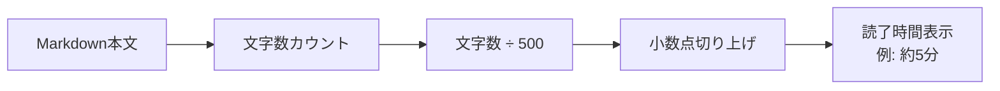

**計算ロジック**:
```typescript
// src/utils/readingTime.ts
export function calculateReadingTime(content: string): number {
  const charsPerMinute = 500; // 日本語: 500文字/分
  const charCount = content.length;
  const minutes = Math.ceil(charCount / charsPerMinute);
  return Math.max(1, minutes); // 最低1分
}
```

### 機能8: 目次生成 (REQ-901) 🟡

**信頼性**: 🟡 *要件から妥当な推測 (h2, h3のみ)*

**関連要件**: REQ-901

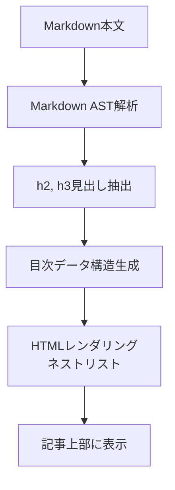

**実装方法**:
```typescript
// Astroのrender()メソッドがheadingsを返す
const { Content, headings } = await post.render();

// headings構造例:
// [
//   { depth: 2, slug: 'section-1', text: 'セクション1' },
//   { depth: 3, slug: 'subsection-1-1', text: 'サブセクション1.1' },
//   { depth: 2, slug: 'section-2', text: 'セクション2' },
// ]

// TOCコンポーネントでレンダリング
<TableOfContents headings={headings} />
```

## データ処理パターン

### ビルド時処理 (SSG) 🔵

**信頼性**: 🔵 *Astroアーキテクチャより*

すべてのページはビルド時に静的HTML生成される。動的処理なし。

### クライアントサイド処理 🟡

**信頼性**: 🟡 *検索機能の推測実装より*

- **検索機能**: クライアントサイドJavaScriptでフィルタリング
- **その他**: 基本的にクライアントサイド処理なし (静的HTMLのみ)

## エラーハンドリングフロー 🔵

**信頼性**: 🔵 *EDGE-001～EDGE-204より*

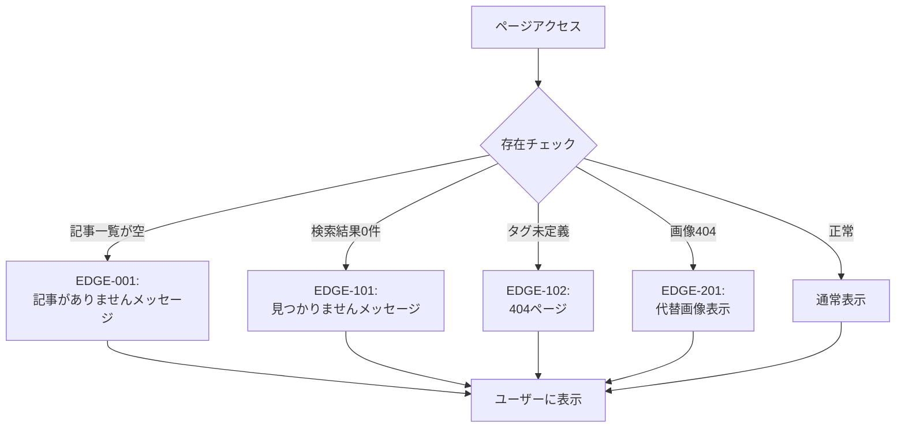

## 状態管理フロー

### サーバーサイド状態管理 🔵

**信頼性**: 🔵 *SSGアーキテクチャより*

状態管理なし (静的サイト)。すべてビルド時に確定。

### クライアントサイド状態管理 🟡

**信頼性**: 🟡 *検索機能の推測実装より*

- **検索機能**: 検索キーワードの状態管理 (ローカル変数)
- **その他**: 基本的に状態管理なし

## データ整合性の保証 🔵

**信頼性**: 🔵 *Content Collections型チェックより*

- **型チェック**: Content Collections schemaによるビルド時バリデーション
- **下書き除外**: 全ての公開ページで `draft !== true` フィルタ適用
- **タグ整合性**: `getStaticPaths()` でビルド時に全タグを抽出し、未定義タグページを生成しない

**ビルド時バリデーション**:
```typescript
// src/content/config.ts
// スキーマ違反の場合はビルドエラー
const blogCollection = defineCollection({
  type: 'content',
  schema: z.object({
    title: z.string(),        // 必須チェック
    pubDate: z.date(),         // 日付型チェック
    tags: z.array(z.string()), // 配列型チェック
    // ...
  }),
});
```

## パフォーマンス最適化フロー 🔵

**信頼性**: 🔵 *NFR-001・tech-stack.mdより*

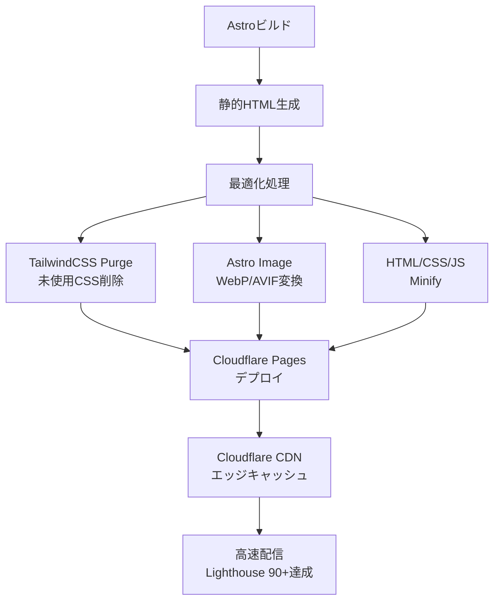

## 関連文書

- **アーキテクチャ**: [architecture.md](architecture.md)
- **型定義**: [interfaces.ts](interfaces.ts)
- **要件定義**: [requirements.md](../../spec/blog-article-management/requirements.md)
- **ユーザストーリー**: [user-stories.md](../../spec/blog-article-management/user-stories.md)
- **受け入れ基準**: [acceptance-criteria.md](../../spec/blog-article-management/acceptance-criteria.md)

## 信頼性レベルサマリー

- 🔵 青信号: 38件 (79.2%)
- 🟡 黄信号: 10件 (20.8%)
- 🔴 赤信号: 0件 (0%)

**品質評価**: 高品質

**評価理由**:
- 主要なデータフローは要件定義書・Astro公式ドキュメントから確実に導出
- 黄信号項目は実装詳細 (検索方法、関連記事アルゴリズム) のみ
- 赤信号項目なし (推測による設計なし)
- SSGアーキテクチャにより、データフローがシンプルで保守性が高い
