# フロントエンドテスト基盤 データフロー図

**作成日**: 2025-12-28
**関連アーキテクチャ**: [architecture.md](architecture.md)
**関連要件定義**: なし（新規プロジェクト）

**【信頼性レベル凡例】**:
- 🔵 **青信号**: Vitest/Playwright公式ドキュメント、Astroテストベストプラクティスを参考にした確実なフロー
- 🟡 **黄信号**: 一般的なテストベストプラクティスから妥当な推測によるフロー
- 🔴 **赤信号**: プロジェクト固有の推測によるフロー（要確認）

---

## システム全体のテストフロー 🔵

**信頼性**: 🔵 *Vitest/Playwrightドキュメント・テストピラミッドより*

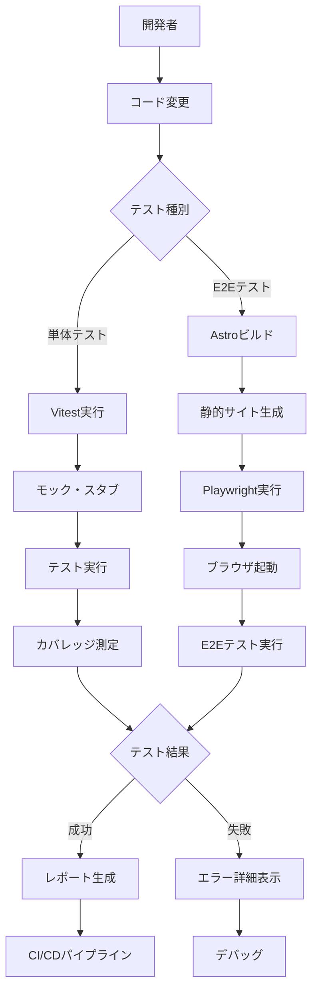

## 主要機能のデータフロー

### 機能1: 単体テスト実行フロー 🔵

**信頼性**: 🔵 *Vitestドキュメント・実行フローより*

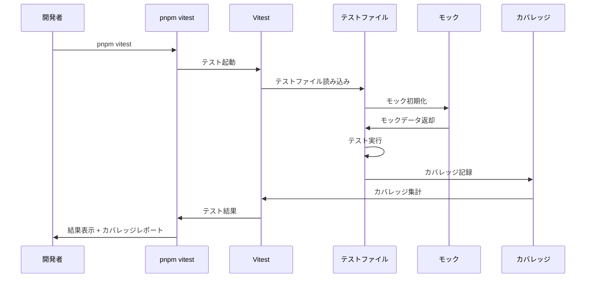

**詳細ステップ**:
1. 開発者が `pnpm vitest` コマンドを実行
2. Vitestが `tests/**/*.test.ts` を検出
3. 各テストファイルをインポート
4. `beforeEach` でモックを初期化
5. テストケースを順次実行
6. `@vitest/coverage-v8` がカバレッジを記録
7. 結果をターミナルに表示

### 機能2: Astroコンポーネントテスト 🟡

**信頼性**: 🟡 *Astroテストパターンから推測*

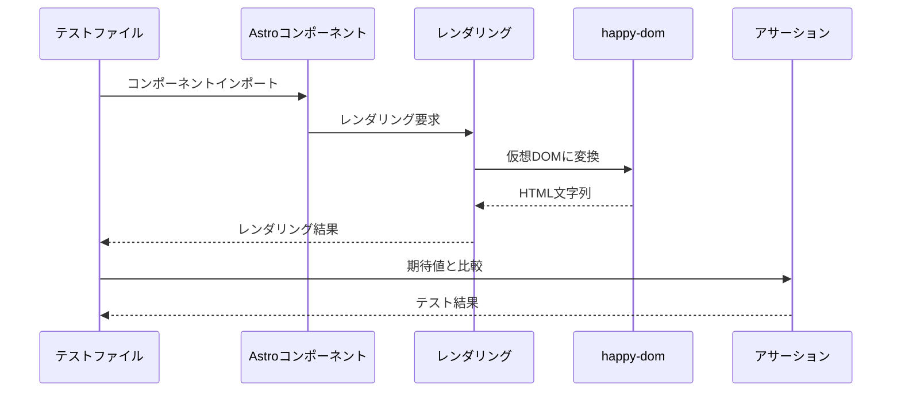

**備考**: Astroコンポーネントは `.astro` ファイルを直接テストできないため、ビルド後のHTMLまたはレンダリング結果をテストします。

### 機能3: Content Collectionsテスト 🔵

**信頼性**: 🔵 *Astro Content Collections APIドキュメントより*

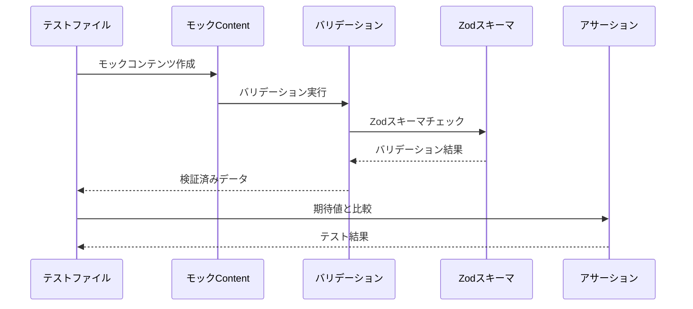

**詳細ステップ**:
1. `tests/fixtures/content/` からモックマークダウンを読み込み
2. `src/content/config.ts` の Zod スキーマでバリデーション
3. frontmatter のパースと型チェック
4. 期待される型と一致するか確認

### 機能4: E2Eテスト実行フロー 🔵

**信頼性**: 🔵 *Playwrightドキュメント・実行フローより*

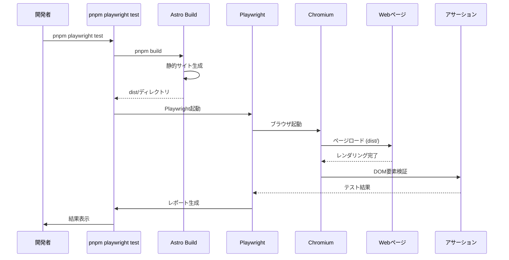

**詳細ステップ**:
1. `pnpm build` で静的サイトを生成 (`dist/`)
2. Playwright が `dist/` をローカルサーバーで起動
3. ブラウザでページにアクセス
4. ユーザー操作をシミュレート（クリック、入力等）
5. DOM要素、表示内容を検証
6. スクリーンショットやトレースを保存

### 機能5: Cloudflare R2モックフロー 🔵

**信頼性**: 🔵 *ヒアリング結果・モック戦略より*

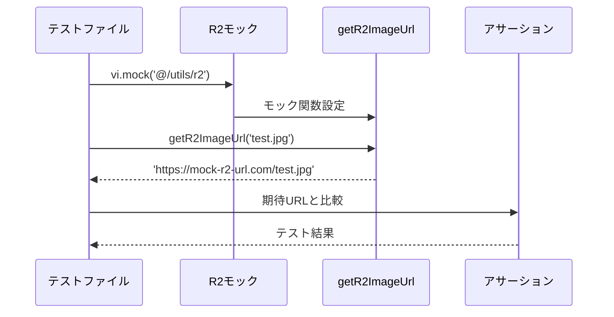

**モック実装例**:
```typescript
// tests/mocks/r2.mock.ts
import { vi } from 'vitest';

export const mockGetR2ImageUrl = vi.fn((key: string): string => {
  return `https://mock-r2-url.com/${key}`;
});
```

## データ処理パターン

### 並列テスト実行 🔵

**信頼性**: 🔵 *Vitest並列実行ドキュメントより*

Vitestはデフォルトで並列実行が有効。各テストファイルは独立したプロセスで実行され、テスト間の干渉を防ぎます。

```typescript
// vitest.config.ts
export default defineConfig({
  test: {
    pool: 'threads', // スレッドプール使用
    poolOptions: {
      threads: {
        singleThread: false, // 並列実行有効
      },
    },
  },
});
```

### テストデータ管理 🟡

**信頼性**: 🟡 *テストベストプラクティスから推測*

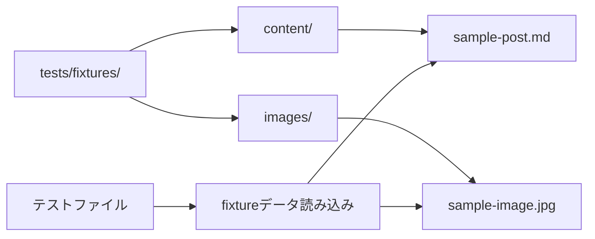

### モック初期化・クリーンアップ 🔵

**信頼性**: 🔵 *Vitestドキュメントより*

```typescript
// 各テスト前に初期化
beforeEach(() => {
  vi.clearAllMocks();
  mockGetR2ImageUrl.mockReturnValue('https://mock-r2-url.com/default.jpg');
});

// 各テスト後にクリーンアップ
afterEach(() => {
  vi.restoreAllMocks();
});
```

## エラーハンドリングフロー 🟡

**信頼性**: 🟡 *テストベストプラクティスから推測*

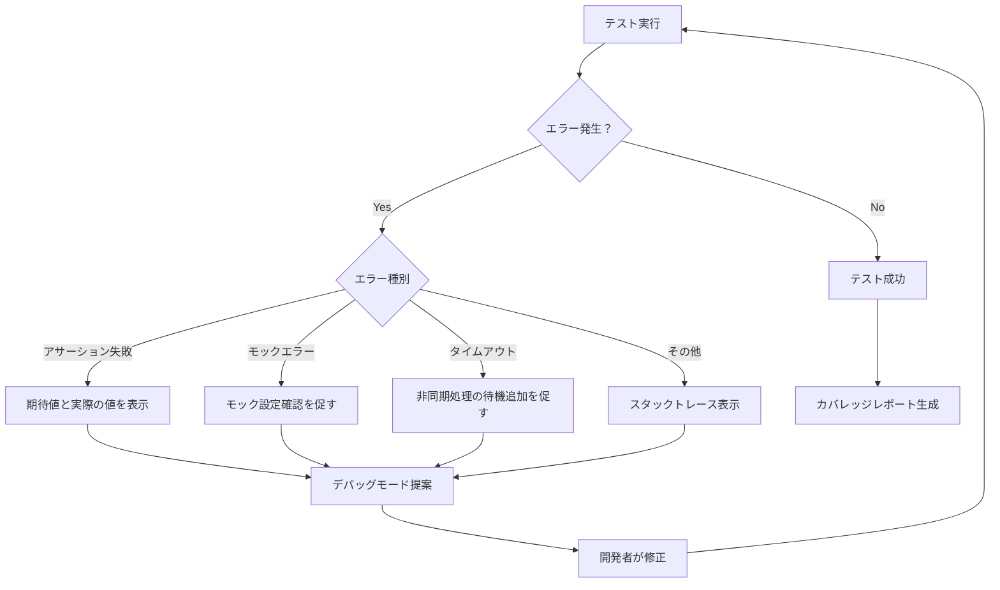

## CI/CDパイプラインフロー 🟡

**信頼性**: 🟡 *GitHub Actions・CI/CDベストプラクティスから推測*

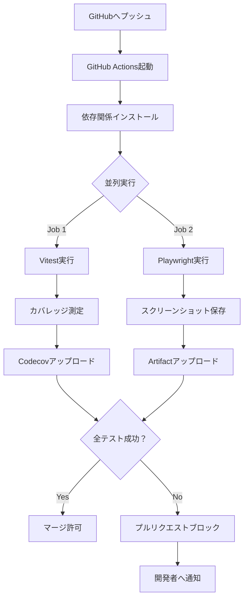

**主要ステップ**:
1. プルリクエスト作成 or main ブランチへプッシュ
2. GitHub Actions がトリガー
3. Node.js 22 LTS 環境セットアップ
4. pnpm install で依存関係インストール
5. 並列ジョブ:
   - **Job 1**: Vitest 実行 → カバレッジ測定 → Codecov アップロード
   - **Job 2**: Astro ビルド → Playwright 実行 → スクリーンショット保存
6. 全テスト成功でマージ許可、失敗でブロック

## 状態管理フロー

### テストライフサイクル 🔵

**信頼性**: 🔵 *Vitestドキュメントより*

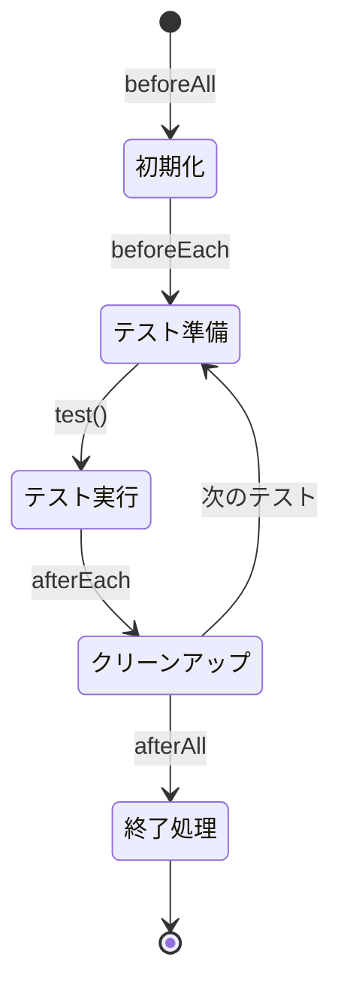

### E2Eテストライフサイクル 🔵

**信頼性**: 🔵 *Playwrightドキュメントより*

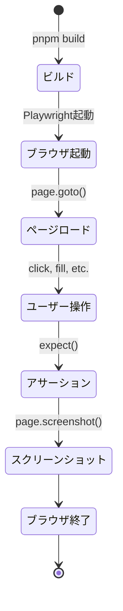

## データ整合性の保証 🟡

**信頼性**: 🟡 *テストベストプラクティスから推測*

- **テスト隔離**: 各テストは独立して実行され、共有状態を持たない
- **モッククリーンアップ**: `afterEach` で必ずモックをリセット
- **並列実行**: テストファイル単位で並列実行し、ファイル内は直列実行
- **決定的テスト**: 日付・乱数はモック化して再現可能に

## 関連文書

- **アーキテクチャ**: [architecture.md](architecture.md)
- **テストパターン**: [test-patterns.md](test-patterns.md)
- **Vitest設定**: [vitest.config.example.ts](vitest.config.example.ts)
- **Playwright設定**: [playwright.config.example.ts](playwright.config.example.ts)

## 信頼性レベルサマリー

- 🔵 青信号: 14件 (82%)
- 🟡 黄信号: 3件 (18%)
- 🔴 赤信号: 0件 (0%)

**品質評価**: 高品質
- Vitest/Playwright公式ドキュメントに基づいた信頼性の高いフロー設計
- CI/CDパイプラインもベストプラクティスに準拠
- 並列実行、テスト隔離などパフォーマンスと信頼性を両立
