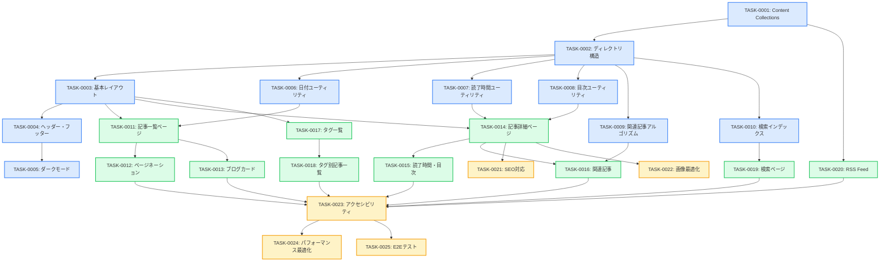

# ブログ記事管理機能 タスク概要

**作成日**: 2025-12-29
**総タスク数**: 25タスク
**総見積もり工数**: 182時間 (約23人日)
**フェーズ数**: 3フェーズ

**関連文書**:
- [要件定義書](../../spec/blog-article-management/requirements.md)
- [アーキテクチャ設計](../../design/blog-article-management/architecture.md)
- [データフロー](../../design/blog-article-management/dataflow.md)
- [型定義](../../design/blog-article-management/interfaces.ts)

---

## 📊 プロジェクトサマリー

### 工数内訳

| フェーズ | タスク数 | 総工数 | 説明 |
|---------|---------|--------|------|
| **Phase 1: 基盤構築** | 10タスク | 58時間 | Content Collections、レイアウト、ユーティリティ関数 |
| **Phase 2: コア機能** | 10タスク | 74時間 | 記事一覧、詳細、タグ、検索、RSS |
| **Phase 3: 非機能・最適化** | 5タスク | 50時間 | SEO、画像最適化、アクセシビリティ、E2Eテスト |

### タスクタイプ別内訳

| タスクタイプ | タスク数 | 工数 | 説明 |
|------------|---------|------|------|
| **DIRECT** | 5タスク | 22時間 | 環境設定、設定ファイル作成 |
| **TDD** | 20タスク | 160時間 | コーディング、ビジネスロジック、UI実装 |

### 優先度別内訳

| 優先度 | タスク数 | 工数 | 説明 |
|--------|---------|------|------|
| **P0 (最優先)** | 12タスク | 86時間 | 基盤構築、必須機能 |
| **P1 (高優先)** | 8タスク | 64時間 | コア機能 |
| **P2 (中優先)** | 5タスク | 32時間 | 非機能要件、最適化 |

---

## 🗓️ Phase 1: 基盤構築 (58時間)

**目標**: Content Collections設定、レイアウト、ユーティリティ関数の実装

| タスクID | タスク名 | タイプ | 工数 | 優先度 | 依存関係 | ステータス |
|---------|---------|------|------|--------|---------|----------|
| TASK-0001 | Content Collections設定とスキーマ定義 | DIRECT | 4h | P0 | なし | ✅ 完了 |
| TASK-0002 | ディレクトリ構造とプロジェクト初期化 | DIRECT | 3h | P0 | TASK-0001 | - |
| TASK-0003 | 基本レイアウトの実装 | TDD | 6h | P0 | TASK-0002 | - |
| TASK-0004 | ヘッダー・フッターコンポーネントの実装 | TDD | 8h | P0 | TASK-0003 | - |
| TASK-0005 | ダークモード切り替え機能の実装 | TDD | 6h | P1 | TASK-0004 |
| TASK-0006 | 日付フォーマットユーティリティの実装 | TDD | 4h | P0 | TASK-0002 |
| TASK-0007 | 読了時間計算ユーティリティの実装 | TDD | 6h | P0 | TASK-0002 |
| TASK-0008 | 目次生成ユーティリティの実装 | TDD | 8h | P0 | TASK-0002 |
| TASK-0009 | 関連記事アルゴリズムの実装 | TDD | 8h | P1 | TASK-0002 |
| TASK-0010 | 検索インデックス生成ユーティリティの実装 | TDD | 5h | P1 | TASK-0002 |

**Phase 1完了条件**:
- [ ] Content Collectionsが正しく動作する
- [ ] 基本レイアウトとヘッダー・フッターが表示される
- [ ] すべてのユーティリティ関数のテストが通る
- [ ] `pnpm astro check` がエラーなく通る

---

## 🗓️ Phase 2: コア機能実装 (74時間)

**目標**: 記事一覧、詳細、タグ、検索、RSS等の主要機能実装

| タスクID | タスク名 | タイプ | 工数 | 優先度 | 依存関係 |
|---------|---------|------|------|--------|---------|
| TASK-0011 | 記事一覧ページ (トップページ) の実装 | TDD | 8h | P0 | TASK-0003, TASK-0006 |
| TASK-0012 | ページネーション機能の実装 | TDD | 8h | P0 | TASK-0011 |
| TASK-0013 | ブログカードコンポーネントの実装 | TDD | 6h | P0 | TASK-0011 |
| TASK-0014 | 記事詳細ページの実装 | TDD | 10h | P0 | TASK-0003, TASK-0007, TASK-0008 |
| TASK-0015 | 読了時間・目次表示コンポーネントの実装 | TDD | 6h | P0 | TASK-0014 |
| TASK-0016 | 関連記事表示コンポーネントの実装 | TDD | 6h | P1 | TASK-0009, TASK-0014 |
| TASK-0017 | タグ一覧ページの実装 | TDD | 6h | P1 | TASK-0003 |
| TASK-0018 | タグ別記事一覧ページの実装 | TDD | 8h | P1 | TASK-0017 |
| TASK-0019 | 検索ページの実装 | TDD | 10h | P1 | TASK-0010 |
| TASK-0020 | RSS Feed生成の実装 | DIRECT | 6h | P1 | TASK-0001 |

**Phase 2完了条件**:
- [ ] 記事一覧・詳細ページが正しく表示される
- [ ] ページネーションが正しく動作する
- [ ] タグ機能が正しく動作する
- [ ] 検索機能が正しく動作する
- [ ] RSS Feedが正しく生成される
- [ ] すべてのE2Eテストが通る

---

## 🗓️ Phase 3: 非機能要件・最適化 (50時間)

**目標**: SEO対策、画像最適化、アクセシビリティ、パフォーマンス最適化

| タスクID | タスク名 | タイプ | 工数 | 優先度 | 依存関係 |
|---------|---------|------|------|--------|---------|
| TASK-0021 | SEO対応 (メタタグ、サイトマップ、JSON-LD) | DIRECT | 8h | P0 | TASK-0014 |
| TASK-0022 | 画像最適化 (Astro Image, R2統合) | TDD | 12h | P0 | TASK-0014 |
| TASK-0023 | アクセシビリティ対応 (WCAG 2.1 AA準拠) | TDD | 10h | P2 | Phase 2完了 |
| TASK-0024 | パフォーマンス最適化 (Lighthouse 90+達成) | TDD | 12h | P2 | Phase 2完了 |
| TASK-0025 | E2Eテスト・統合テストの実装 | TDD | 8h | P2 | Phase 2完了 |

**Phase 3完了条件**:
- [ ] Lighthouse スコア 90+点を達成
- [ ] WCAG 2.1 AA準拠を達成
- [ ] SEOメタタグ、サイトマップが正しく生成される
- [ ] 画像が自動最適化される
- [ ] すべてのE2Eテストが通る

---

## 📋 全タスク一覧

### Phase 1: 基盤構築

#### TASK-0001: Content Collections設定とスキーマ定義 🔵
- **タイプ**: DIRECT
- **工数**: 4時間
- **優先度**: P0
- **関連要件**: REQ-001~REQ-011, REQ-301, REQ-501
- **概要**: Zodスキーマによる型安全なコンテンツ管理基盤の構築
- **依存**: なし

#### TASK-0002: ディレクトリ構造とプロジェクト初期化 🔵
- **タイプ**: DIRECT
- **工数**: 3時間
- **優先度**: P0
- **関連要件**: REQ-001~REQ-904 (全体)
- **概要**: プロジェクト全体のディレクトリ構造構築、グローバルスタイル設定
- **依存**: TASK-0001

#### TASK-0003: 基本レイアウトの実装 🔵
- **タイプ**: TDD
- **工数**: 6時間
- **優先度**: P0
- **関連要件**: NFR-301~304 (アクセシビリティ)
- **概要**: BaseLayout, BlogPostLayoutの実装
- **依存**: TASK-0002

#### TASK-0004: ヘッダー・フッターコンポーネントの実装 🔵
- **タイプ**: TDD
- **工数**: 8時間
- **優先度**: P0
- **関連要件**: NFR-301~304 (アクセシビリティ)
- **概要**: Header, Footer, ナビゲーションの実装
- **依存**: TASK-0003

#### TASK-0005: ダークモード切り替え機能の実装 🔵
- **タイプ**: TDD
- **工数**: 6時間
- **優先度**: P1
- **関連要件**: tech-stack.md (ダークモードデフォルト)
- **概要**: ThemeToggleコンポーネント、localStorage連携
- **依存**: TASK-0004

#### TASK-0006: 日付フォーマットユーティリティの実装 🔵
- **タイプ**: TDD
- **工数**: 4時間
- **優先度**: P0
- **関連要件**: REQ-001 (公開日・更新日表示)
- **概要**: `formatDate()`, `formatRelativeDate()` の実装
- **依存**: TASK-0002

#### TASK-0007: 読了時間計算ユーティリティの実装 🔵
- **タイプ**: TDD
- **工数**: 6時間
- **優先度**: P0
- **関連要件**: REQ-801 (読了時間表示)
- **概要**: `calculateReadingTime()` の実装 (500文字/分)
- **依存**: TASK-0002

#### TASK-0008: 目次生成ユーティリティの実装 🔵
- **タイプ**: TDD
- **工数**: 8時間
- **優先度**: P0
- **関連要件**: REQ-901 (目次自動生成)
- **概要**: `generateTOC()` の実装 (h2, h3抽出)
- **依存**: TASK-0002

#### TASK-0009: 関連記事アルゴリズムの実装 🔵
- **タイプ**: TDD
- **工数**: 8時間
- **優先度**: P1
- **関連要件**: REQ-701 (関連記事表示)
- **概要**: タグベース類似度計算アルゴリズム
- **依存**: TASK-0002

#### TASK-0010: 検索インデックス生成ユーティリティの実装 🟡
- **タイプ**: TDD
- **工数**: 5時間
- **優先度**: P1
- **関連要件**: REQ-401~402 (検索機能)
- **概要**: ビルド時検索インデックスJSON生成
- **依存**: TASK-0002

---

### Phase 2: コア機能実装

#### TASK-0011: 記事一覧ページ (トップページ) の実装 🔵
- **タイプ**: TDD
- **工数**: 8時間
- **優先度**: P0
- **関連要件**: REQ-101 (記事一覧表示)
- **概要**: `src/pages/index.astro` - 最新記事5件表示
- **依存**: TASK-0003, TASK-0006

#### TASK-0012: ページネーション機能の実装 🔵
- **タイプ**: TDD
- **工数**: 8時間
- **優先度**: P0
- **関連要件**: REQ-201 (ページネーション)
- **概要**: `src/pages/blog/[page].astro` - 5件/ページ
- **依存**: TASK-0011

#### TASK-0013: ブログカードコンポーネントの実装 🔵
- **タイプ**: TDD
- **工数**: 6時間
- **優先度**: P0
- **関連要件**: REQ-101 (記事一覧表示)
- **概要**: BlogCardコンポーネント - カバー画像、タイトル、説明、タグ
- **依存**: TASK-0011

#### TASK-0014: 記事詳細ページの実装 🔵
- **タイプ**: TDD
- **工数**: 10時間
- **優先度**: P0
- **関連要件**: REQ-102 (記事詳細表示)
- **概要**: `src/pages/blog/[slug].astro` - Markdown→HTML、Shikiハイライト
- **依存**: TASK-0003, TASK-0007, TASK-0008

#### TASK-0015: 読了時間・目次表示コンポーネントの実装 🔵
- **タイプ**: TDD
- **工数**: 6時間
- **優先度**: P0
- **関連要件**: REQ-801, REQ-901
- **概要**: ReadingTime, TableOfContentsコンポーネント
- **依存**: TASK-0014

#### TASK-0016: 関連記事表示コンポーネントの実装 🔵
- **タイプ**: TDD
- **工数**: 6時間
- **優先度**: P1
- **関連要件**: REQ-701 (関連記事表示)
- **概要**: RelatedArticlesコンポーネント
- **依存**: TASK-0009, TASK-0014

#### TASK-0017: タグ一覧ページの実装 🔵
- **タイプ**: TDD
- **工数**: 6時間
- **優先度**: P1
- **関連要件**: REQ-302 (タグ一覧表示)
- **概要**: `src/pages/tags/index.astro` - すべてのタグと記事数
- **依存**: TASK-0003

#### TASK-0018: タグ別記事一覧ページの実装 🔵
- **タイプ**: TDD
- **工数**: 8時間
- **優先度**: P1
- **関連要件**: REQ-303 (タグフィルタリング)
- **概要**: `src/pages/tags/[tag].astro` - タグ別記事一覧
- **依存**: TASK-0017

#### TASK-0019: 検索ページの実装 🟡
- **タイプ**: TDD
- **工数**: 10時間
- **優先度**: P1
- **関連要件**: REQ-401~402 (検索機能)
- **概要**: `src/pages/search.astro` - クライアントサイド検索
- **依存**: TASK-0010

#### TASK-0020: RSS Feed生成の実装 🔵
- **タイプ**: DIRECT
- **工数**: 6時間
- **優先度**: P1
- **関連要件**: REQ-601 (RSS Feed生成)
- **概要**: `src/pages/rss.xml.ts` - RSS 2.0フィード生成
- **依存**: TASK-0001

---

### Phase 3: 非機能要件・最適化

#### TASK-0021: SEO対応 (メタタグ、サイトマップ、JSON-LD) 🔵
- **タイプ**: DIRECT
- **工数**: 8時間
- **優先度**: P0
- **関連要件**: NFR-101~104 (SEO)
- **概要**: SEOコンポーネント、サイトマップ、JSON-LD
- **依存**: TASK-0014

#### TASK-0022: 画像最適化 (Astro Image, R2統合) 🔵
- **タイプ**: TDD
- **工数**: 12時間
- **優先度**: P0
- **関連要件**: NFR-201~203 (画像最適化)
- **概要**: Astro Image統合、WebP/AVIF変換、R2アップロード
- **依存**: TASK-0014

#### TASK-0023: アクセシビリティ対応 (WCAG 2.1 AA準拠) 🟡
- **タイプ**: TDD
- **工数**: 10時間
- **優先度**: P2
- **関連要件**: NFR-301~304 (アクセシビリティ)
- **概要**: ARIA属性、キーボードナビゲーション、スクリーンリーダー対応
- **依存**: Phase 2完了

#### TASK-0024: パフォーマンス最適化 (Lighthouse 90+達成) 🟡
- **タイプ**: TDD
- **工数**: 12時間
- **優先度**: P2
- **関連要件**: NFR-001 (パフォーマンス)
- **概要**: 遅延ローディング、CSS最適化、JavaScript最小化
- **依存**: Phase 2完了

#### TASK-0025: E2Eテスト・統合テストの実装 🟡
- **タイプ**: TDD
- **工数**: 8時間
- **優先度**: P2
- **関連要件**: すべて
- **概要**: Playwright E2Eテスト、主要フローのカバレッジ
- **依存**: Phase 2完了

---

## 🔗 タスク依存関係図

---

## 📈 進捗管理

### フェーズ別進捗

| フェーズ | ステータス | 完了タスク | 総タスク | 進捗率 |
|---------|----------|-----------|---------|--------|
| Phase 1 | Not Started | 0 | 10 | 0% |
| Phase 2 | Not Started | 0 | 10 | 0% |
| Phase 3 | Not Started | 0 | 5 | 0% |
| **全体** | **Not Started** | **0** | **25** | **0%** |

### 工数進捗

| フェーズ | 実績工数 | 見積もり工数 | 進捗率 |
|---------|---------|------------|--------|
| Phase 1 | 0h | 58h | 0% |
| Phase 2 | 0h | 74h | 0% |
| Phase 3 | 0h | 50h | 0% |
| **全体** | **0h** | **182h** | **0%** |

---

## 🎯 マイルストーン

### Milestone 1: 基盤完成 (Phase 1完了)
- **目標日**: TBD
- **完了条件**:
  - [ ] Content Collectionsが正しく動作する
  - [ ] 基本レイアウトが実装されている
  - [ ] すべてのユーティリティ関数のテストが通る

### Milestone 2: コア機能完成 (Phase 2完了)
- **目標日**: TBD
- **完了条件**:
  - [ ] 記事一覧・詳細ページが動作する
  - [ ] タグ・検索・RSS機能が動作する
  - [ ] すべてのE2Eテストが通る

### Milestone 3: 本番リリース準備完了 (Phase 3完了)
- **目標日**: TBD
- **完了条件**:
  - [ ] Lighthouse 90+点達成
  - [ ] WCAG 2.1 AA準拠達成
  - [ ] すべてのテストが通る

---

## 🔍 品質基準

### コード品質

- **TypeScript型チェック**: `pnpm astro check` エラーなし
- **リント**: `pnpm biome check` エラーなし
- **単体テストカバレッジ**: 80%以上 (ユーティリティ関数)
- **E2Eテストカバレッジ**: 主要フロー100%

### パフォーマンス

- **Lighthouse Performance**: 90+点
- **Lighthouse Accessibility**: 90+点
- **Lighthouse Best Practices**: 90+点
- **Lighthouse SEO**: 90+点

### アクセシビリティ

- **WCAG 2.1 AA準拠**: 100%
- **キーボードナビゲーション**: 全機能対応
- **スクリーンリーダー対応**: ARIA属性完備

---

## 📚 関連文書

### 要件定義・仕様書
- [要件定義書](../../spec/blog-article-management/requirements.md)
- [ユーザーストーリー](../../spec/blog-article-management/user-stories.md)
- [受け入れ基準](../../spec/blog-article-management/acceptance-criteria.md)
- [ヒアリング記録](../../spec/blog-article-management/interview-record.md)

### 設計文書
- [アーキテクチャ設計](../../design/blog-article-management/architecture.md)
- [データフロー](../../design/blog-article-management/dataflow.md)
- [型定義](../../design/blog-article-management/interfaces.ts)
- [設計ヒアリング記録](../../design/blog-article-management/design-interview.md)

### プロジェクト基本情報
- [技術スタック定義](../../tech-stack.md)
- [タスクノート](../../spec/blog-article-management/note.md)

---

## 📊 信頼性レベルサマリー

全25タスクの信頼性レベル分布:

- 🔵 **青信号**: 20タスク (80%) - 設計文書から確実に定義
- 🟡 **黄信号**: 5タスク (20%) - 設計文書から妥当な推測
- 🔴 **赤信号**: 0タスク (0%)

**品質評価**: 高品質 (🔵 80%以上)

---

## 🏷️ タグ一覧

`astro`, `content-collections`, `typescript`, `tailwind`, `seo`, `accessibility`, `performance`, `tdd`, `e2e-testing`, `lighthouse`, `wcag`

---

**最終更新日**: 2025-12-29
**更新者**: Claude Sonnet 4.5 (Kairo設計エージェント)
