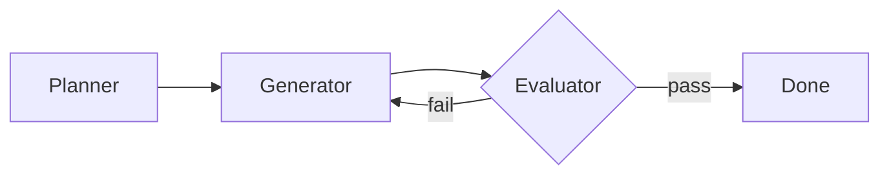
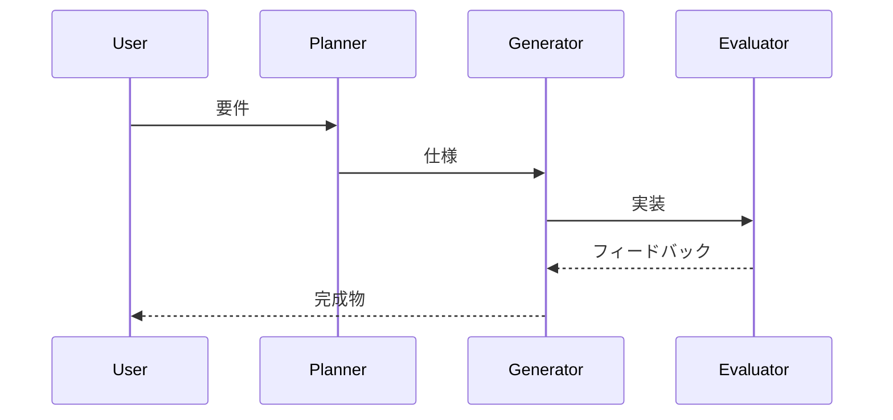
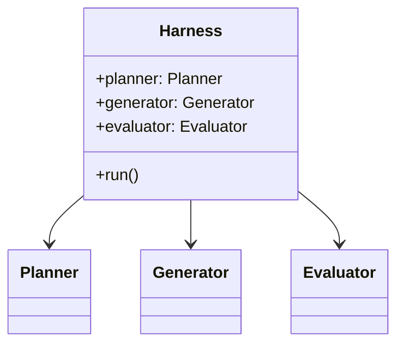

このページは Mermaid 統合 PR の動作確認専用です。本番では Content Collection の glob (`[^_]*.{md,mdx}`) により除外されます。

## Flowchart

```mermaid
flowchart LR
  A[Planner] --> B[Generator]
  B --> C{Evaluator}
  C -->|pass| D[Done]
  C -->|fail| B
```

## Sequence Diagram

```mermaid
sequenceDiagram
  participant U as User
  participant P as Planner
  participant G as Generator
  participant E as Evaluator
  U->>P: 要件
  P->>G: 仕様
  G->>E: 実装
  E-->>G: フィードバック
  G-->>U: 完成物
```

## Class Diagram

```mermaid
classDiagram
  class Harness {
    +planner: Planner
    +generator: Generator
    +evaluator: Evaluator
    +run()
  }
  class Planner
  class Generator
  class Evaluator
  Harness --> Planner
  Harness --> Generator
  Harness --> Evaluator
```
