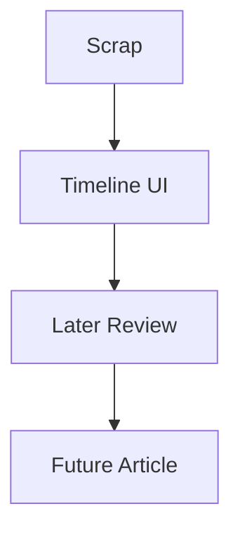

コードブロックや Mermaid の扱いは、ブログ記事と別実装にしない方が保守しやすい。

```ts
const sortByDateDesc = <T extends { date: Date }>(items: T[]) =>
  items.sort((a, b) => b.date.getTime() - a.date.getTime());
```


```mermaid
graph TD
  Note[Scrap] --> Timeline[Timeline UI]
  Timeline --> Review[Later Review]
  Review --> Article[Future Article]
```
